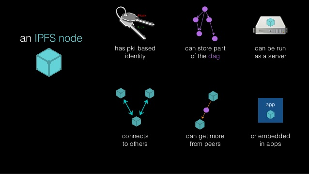

## IPFS Overview

- **I**nter**P**lanetary **F**ile **S**ystem
- Distributed
- Immutable
- Permanent

---

## IPFS Modules

(https://www.slideshare.net/InfoQ/data-structures-in-and-on-ipfs)

---

## IPFS Node

(https://www.slideshare.net/InfoQ/data-structures-in-and-on-ipfs)