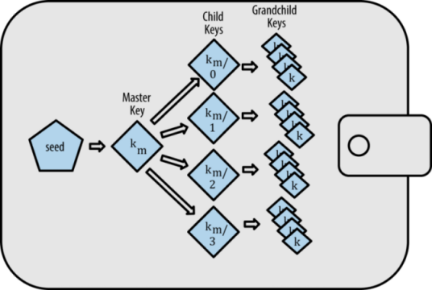

## Bitcoin Improvement Proposal
(BIP)

- A design document for introducing features or information to Bitcoin
- BIP32: Hierarchical Deterministic Wallets
- BIP39: Mnemonic code for generating deterministic keys
- BIP44: Multi-Account Hierarchy for Deterministic Wallets 

         m/purpose'/coin_type'/account'/change/address_index

---

## Hierarchical Deterministic Wallet



<small>Master Bitcoin (http://chimera.labs.oreilly.com/books/1234000001802/ch04.html)</small>

---

## BTC Wallet

```javascript
let mnemonic = 'awesome bulb divert half alone dinner talk harbor swallow figure deliver scheme';
let salt = '@LborHJH?NwI';
let aliceSeed = bip39.mnemonicToSeed(mnemonic, salt);
let alice = HDNode.fromSeedBuffer(aliceSeed, networks.bitcoin);
let aliceBtc = alice.derivePath("m/44'/0'/0'/0/0");
```

```javascript
console.log('alice btc address:', aliceBtc.getAddress());
console.log('alice btc pub key:', aliceBtc.keyPair.getPublicKeyBuffer().toString('hex'));
console.log('alice btc private key:', aliceBtc.keyPair.toWIF());
```

```
alice btc address: 19EPMXMojGCCWem8c5GsB3c56e5tddZf4b
alice btc pub key: 0383e21310369c5d180ca2aab9b42925eaa5cba339d5cedc844512825d78adf851
alice btc private key: KzxyfeGwnxpWuMsLFUR7HMcKdCYS3LzzzMjvR55Q1Ut6Pdym8FUW
```

---

## ETH Wallet

```javascript
let mnemonic = 'awesome bulb divert half alone dinner talk harbor swallow figure deliver scheme';
let salt = '@LborHJH?NwI';
let aliceSeed = bip39.mnemonicToSeed(mnemonic, salt);
let alice = HDNode.fromSeedBuffer(aliceSeed, networks.bitcoin);
let aliceEth = alice.derivePath("m/44'/60'/0'/0/0");
```

```javascript
let privKeyBuffer = aliceEth.keyPair.d.toBuffer();
let addressBuffer = EthU.privateToAddress(privKeyBuffer);
let ethAddress = EthU.toChecksumAddress(addressBuffer.toString('hex'));
console.log('alice eth address:', ethAddress);
console.log('alice eth pub key:', aliceEth.keyPair.getPublicKeyBuffer().toString('hex'));
console.log('alice eth private key:', privKeyBuffer.toString('hex'));
```

```
alice eth address: 0xC6A51D12d24a77ee99d430eBD1F659C05e097dc8
alice eth pub key: 0390f082f739d37bcd90600236ec3114470afa6d0be37cd376a537686a2766cb73
alice eth private key: da528ea04f5e121b87cea7e3b739a2ebcb4a0520ecee50ed38b21461d1e76eff
```