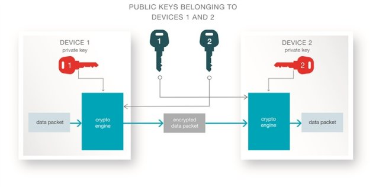

## Elliptic Curve Digital Signature Algorithm 
(ECDSA)

- ECDSA_SIGN (Hash, Private Key) = (V, R, S)
  * V, a single byte value
  * R, a 32 byte value
  * S, a 32 byte value
  
- ECDSA_RECOVER(Hash, V, R, S) = Public Key

---

## Blokaly Web Token
(BWT)

- Ideas from [Ethereum Web Token](https://github.com/cyfin-io/ether-token-js) and [JSON Web Token](https://jwt.io)
- Consists of two parts separated by a dot (.), which are
  * Payload: Base64Url encoded string of a json object (Hash and V)
  * Signature: JOSE encoded string of R and S
  
```
Hash: fed48e488f3d97f08321a238b8c5bb364f82b14c17ae65230651418a0c014374

Token: eyJoYXNoIjoiZmVkNDhlNDg4ZjNkOTdmMDgzMjFhMjM4YjhjNWJiMzY0ZjgyYjE0YzE3YWU2NTIzMDY1MTQxOGEwYzAxNDM3NCIsInYiOjF9.rXPSzMO64fu2cznFl24_GFc8bM8RROwE56_IVJpnlh4iO9Iez35-I2sKarGmh6DHDpy0WDVMw496ZmfFoxGJfQ
```  

---

## Blokaly Web Token

```javascript
let mnemonic = 'awesome bulb divert half alone dinner talk harbor swallow figure deliver scheme';
let saltStr = '@LborHJH?NwI';
let aliceSeed = bip39.mnemonicToSeed(mnemonic, saltStr);
let alice = HDNode.fromSeedBuffer(aliceSeed, networks.bitcoin);
let aliceEth = alice.derivePath("m/44'/60'/0'/0/0");
let privKeyBuffer = aliceEth.keyPair.d.toBuffer();

let text = 'Hello Blokaly!';
let sum = NJCrypto.createHash('sha256');
sum.update(text + saltStr);
let digest = sum.digest('hex');

let sig = ethutils.ecsign(Buffer.from(digest, 'hex'), privKeyBuffer);
let token = EncodeWebToken(digest, sig);

console.log('Hash:', digest);
console.log('Token:', token);
```  

---

## ECDH
(Elliptic Curve Diffie-Hellman)



(https://e2e.ti.com/blogs_/b/connecting_wirelessly/archive/2016/08/11/how-bluetooth-4-2-can-help-enable-product-security)